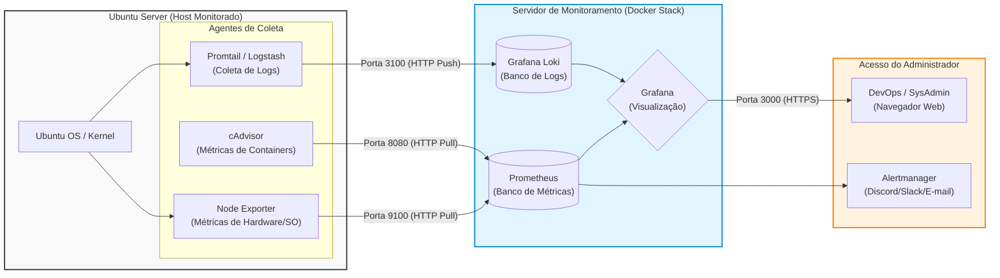

# Projeto Ubuntu Server - Infraestrutura e Segurança de Redes

## Descrição

Este projeto foi desenvolvido para a disciplina de Introdução à Computação e apresenta uma solução de infraestrutura utilizando Ubuntu Server como servidor principal para gerenciamento de serviços, armazenamento de dados e acesso remoto seguro.

O objetivo é demonstrar a implementação de um ambiente resiliente, conectado e protegido, seguindo os princípios de disponibilidade, integridade e confiabilidade.

## Objetivos

- Implementar um servidor utilizando Ubuntu Server.
- Disponibilizar serviços de rede de forma segura.
- Aplicar mecanismos de proteção contra falhas de hardware, software e segurança.
- Demonstrar boas práticas de administração de sistemas Linux.

## Arquitetura da Rede

Fluxo de dados:

Internet → Roteador → Firewall (UFW) → Switch → Ubuntu Server

Tecnologias utilizadas:

- Ubuntu Server 24.04 LTS
- Ethernet Gigabit
- Wi-Fi
- HTTPS
- SSH
- UFW Firewall
- Fail2Ban

## Matriz de Risco

### Falha de Hardware
- Falta de energia elétrica
- Impacto: Alto

### Falha de Software
- Configuração incorreta de permissões
- Impacto: Alto

### Falha de Rede/Segurança
- Ataque de força bruta via SSH
- Impacto: Alto

## Medidas de Mitigação

### Hardware
- Utilização de nobreak (UPS)
- Backups periódicos

### Software
- Atualizações regulares
- Controle de permissões

### Rede e Segurança
- Firewall UFW
- Fail2Ban
- Autenticação SSH por chave pública
- Segmentação por VLAN

## Comandos Utilizados
```bash
sudo apt update
sudo apt upgrade -y
### Atualização do sistema

```



```bash
sudo apt update
sudo apt upgrade -y

